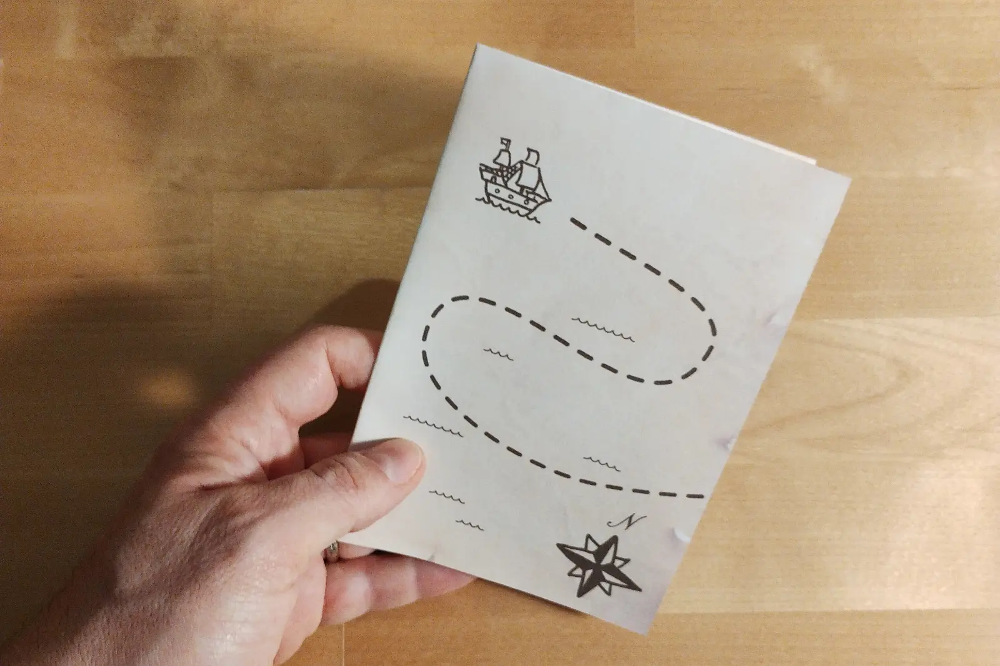
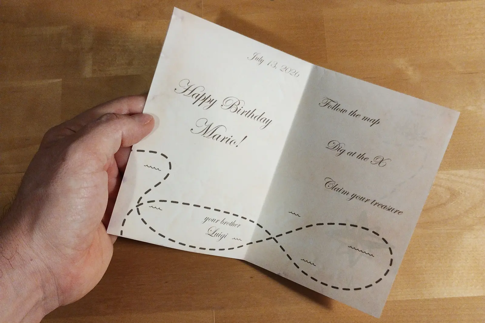
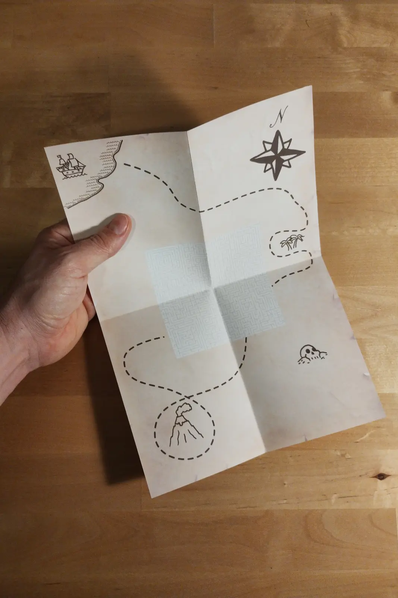
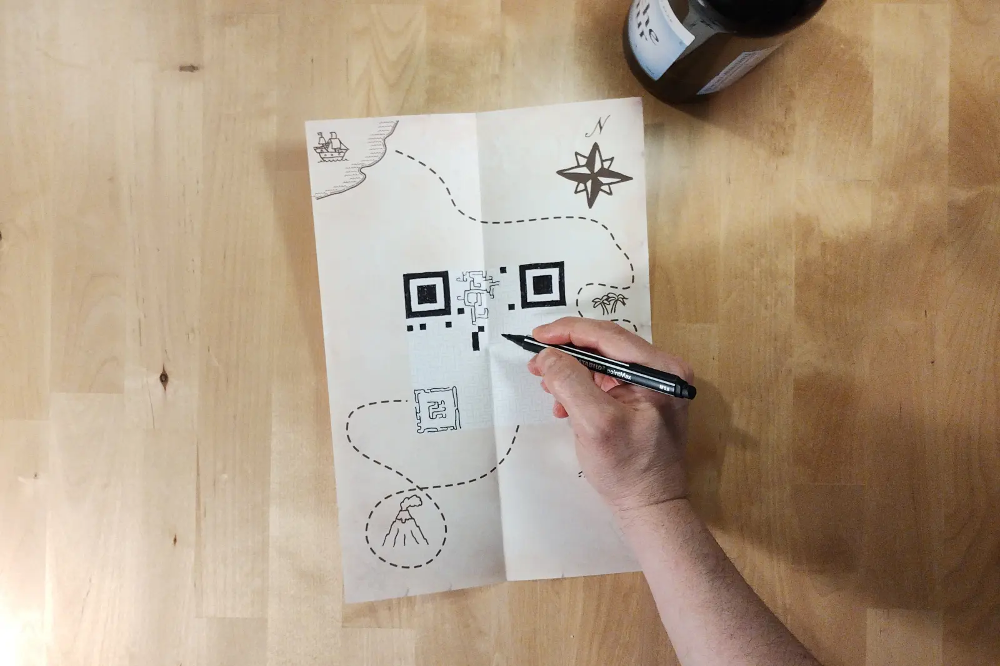

# qriddle

Hide a message inside a printable greeting card. The card opens into a treasure
map, the map is a puzzle, and solving the puzzle draws a QR code that decodes back to
your message.

**Try it: [danilosanchi.net/qriddle](https://danilosanchi.net/qriddle/)**

<p>
  
  
  
  
</p>

## How the puzzle works

Your message is encoded into a QR code, which is just a grid of black and white
squares. Group the adjacent squares of the same colour and you get a set of
monochrome areas.

Each area is then carved into a maze: start from all walls up, and dig a spanning
tree through the area with a depth-first walk that is biased towards going
straight. A spanning tree means every cell in the area is reachable from every
other one, with exactly one route between them — no loops. The bias towards
straight moves (`biasStraight` in `src/lib/config`) is what turns an even sprawl
into long, winding corridors.

Since walls only ever fall between cells of the same colour, the corridors never
cross the boundary between a black area and a white one. So a single dot placed
in each black area is enough to define the whole solution: whatever you can reach
from a dot without crossing a wall is black, everything else is white. Fill it in
and the QR code appears.

The corridors stay one cell wide, so the maze never opens into an ambiguous blob
and the player always has a path to follow rather than a region to shade.

The maze is generated from a seed, and the seed lives in the URL along with the
rest of the card — so a card is a link, and the same link always produces the
same maze.

## Running it

```sh
npm install
npm run dev      # http://localhost:5173
npm run check    # format + lint + typecheck + tests
npm run build
```

Requires Node 20+. There is no backend: everything — QR encoding, maze
generation, PDF composition — happens in the browser.

## How the code is laid out

```
src/lib/domain/image     Coord, Direction, Image — the QR grid as a value object
src/lib/domain/puzzle    Areas, edges, dots, and the maze carving (path.ts)
src/lib/render           Canvas rendering and the two-page A4 PDF
src/lib/browser          Card state serialised into the URL hash (lz-string)
src/views                One view per step of the wizard
src/components           Layout, navigation, canvas stages, the SVG text editor
```

The domain layer under `src/lib/domain` has no React and no DOM in it, which is
why it carries most of the test suite.

The card itself is an SVG spread — `src/assets/outer` for the printed outside,
`src/assets/inner` for the inside — composed with the puzzle and the handwritten
text into a two-page A4 PDF you print double-sided and fold.

## Built with

React 19, TypeScript, Vite, Vitest, plus `qrcode` for encoding, `jspdf` for the
printable output and `lz-string` to squeeze the card state into a URL.

Deployed to GitHub Pages on every push to `master`
(`.github/workflows/deploy.yml`).

## License

[CC BY-NC-SA 4.0](LICENSE) — use it, read it, copy it, modify it, but not
commercially without asking me first.

Some material in this repository is not mine and is not covered by that license:
see [NOTICE](NOTICE) for the fonts and the parchment texture.
