# Anatomia della pergamena

Come [`tools/generate-parchment.py`](../../tools/generate-parchment.py)
costruisce la carta del biglietto, riga per riga di `generate()`.

## L'idea in una riga

C'è un solo array di numeri, `luminance`: quanto è chiaro ogni pixel, da 0 a 1.
Parte piatto a 0,90 e ogni strato ci somma o ci sottrae qualcosa. Il colore non
esiste fino alla fine — l'ultimo passaggio traduce la luminanza in una rampa dal
bruciato al crema. Finché non arrivi lì stai lavorando in bianco e nero, e
questo è il motivo per cui la palette si può cambiare senza toccare
nient'altro.

```python
luminance = np.full((HEIGHT, WIDTH), 0.90)   # foglio piatto
luminance += ...                             # più chiaro qui
luminance -= ...                             # più scuro là
pixels = colourise(luminance)                # solo ora diventa colore
```

## I mattoni

Cinque funzioni, e tutto il resto è combinarle. Le immagini sono i campi
grezzi, in scala di grigi.

|                              |                                                                                                                                                                                                     |
| ---------------------------- | --------------------------------------------------------------------------------------------------------------------------------------------------------------------------------------------------- |
| 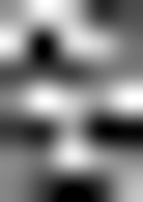 | **`noise`** — una griglia di numeri casuali piccola, poniamo 4×6, ingrandita a tutta la texture in bicubico. Ne esce una macchia morbida: è _un'ottava_.                                            |
| 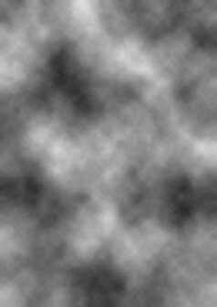    | **`fbm`** — la stessa cosa a frequenze raddoppiate, sommate con ampiezza calante: 4×6, poi 8×12, poi 16×24… Ogni ottava aggiunge dettaglio più fine. `falloff` decide quanto restano forti le fini. |
| 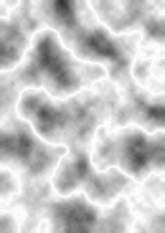 | **ripiegatura** — `1 - abs(2n - 1)` ribalta la metà alta sulla bassa. Dove il campo attraversava 0,5 ora c'è una cresta netta: _lì_ nascono le pieghe.                                              |
| 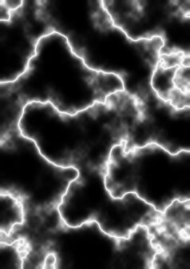  | **`creases`** — elevando a potenza la ripiegatura, tutto ciò che non è quasi 1 crolla a 0. Resta solo la linea: è `FOLD_SHARPNESS`.                                                                 |
| 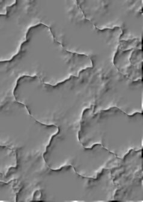 | **`relief`** — sposta il campo in diagonale e ne fa la differenza con sé stesso. Dove sale è chiaro, dove scende è scuro: il rilievo. Senza questo una piega sembra una macchia.                    |
| 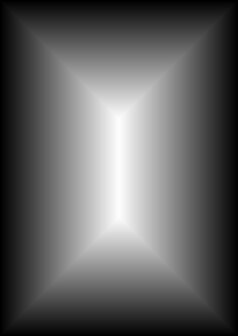   | **`edge_distance`** — non è casuale: per ogni pixel, quanto dista dal bordo più vicino. Serve a far succedere le cose _vicino al margine_. `corner_distance` fa lo stesso dagli angoli.             |

## `generate()`, passo per passo

Ogni immagine è `luminance` colorata in quel momento, con lo stato che ha dopo
la riga citata.

### 1. Il foglio piatto

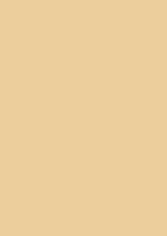

```python
luminance = np.full((HEIGHT, WIDTH), 0.90)
```

Tutto lo stesso valore. Su questo si dipinge per sottrazione, come
un'acquaforte al contrario.

### 2. Il corpo


```python
luminance += 0.20 * (fbm(rng, cells=2) - 0.45)
```

Due celle di partenza: variazioni larghe quanto mezzo foglio. Il `- 0.45`
centra il rumore attorno allo zero, così somma e sottrae invece di schiarire
soltanto. Senza questo strato la carta sarebbe una tinta piatta.

### 3. La grana

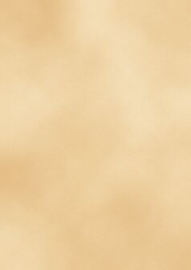

```python
luminance += 0.05 * (grain(rng) - 0.5)
```

Rumore per pixel, più una versione stirata in orizzontale per simulare le
fibre. Ampiezza minuscola: a schermo quasi non si vede, ma toglie quell'aria di
sfumatura digitale perfetta.

### 4. Gli aloni

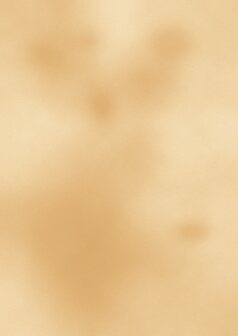

```python
luminance -= 1.2 * stains(rng, count=11)
```

Undici gaussiane con centro, raggio, schiacciamento e decadimento casuali. È
l'unico strato che non nasce da un campo di rumore ma da una formula per
macchia — serve un'irregolarità che il rumore, per sua natura uniforme, non dà.

### 5. Le pieghe

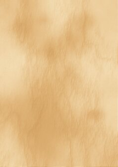

```python
folds = creases(rng, cells=3, sharpness=FOLD_SHARPNESS,
                finest_cell_px=FOLD_SIZE_PX, stretch=0.4,
                roughness=FOLD_ROUGHNESS)
luminance += relief(folds, FOLD_HEIGHT, FOLD_SIZE_PX * SLOPE_SPAN)
luminance -= 0.055 * folds
```

Due righe per una cosa sola: la piega prende luce (`relief`) _e_ resta un po'
più scura del foglio (`0.055`), perché la carta piegata trattiene sporco.
`stretch=0.4` le allunga in verticale, nel verso in cui un foglio si arrotola.

### 6. Le crepe

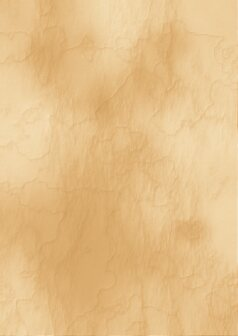

```python
hairlines = creases(rng, cells=7, sharpness=18.0, ...)
```

Lo stesso meccanismo a frequenza più alta e con creste molto più sottili.
Isotrope, senza `stretch`: le crepe non seguono la direzione della piegatura.

### 7. Il bordo

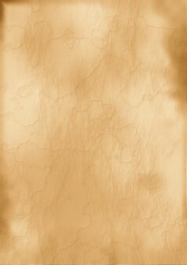

```python
edge = distance + fray
reach = EDGE_REACH * (1.0 + (EDGE_TONGUES - 1.0) * ...)
luminance -= EDGE_SHADE * (0.30 + 2.6 * patches) * \
             (1.0 - smoothstep(0.0, reach, edge)) ** 1.5
```

Qui c'è il trucco che rende il bordo credibile. `smoothstep` di solito prende
due soglie fisse, ma qui la seconda — `reach` — è a sua volta un campo: cambia
da pixel a pixel. Per questo la fascia entra più a fondo in alcuni punti.
`fray` ne sfrangia il limite interno, `patches` ne varia la profondità.

### 8. Gli angoli

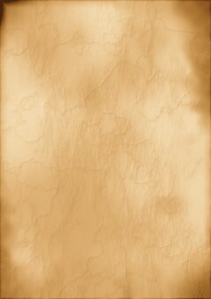

```python
corners = (1.0 - smoothstep(0.0, CORNER_REACH, corner_distance())) ** 1.7
corners *= 0.55 + 0.9 * fbm(rng, cells=2, finest_cell_px=40)
luminance -= EDGE_SHADE * 1.15 * corners
```

Sottrazione a sé stante, non un rinforzo della fascia di prima. Il primo
tentativo alzava i parametri del bordo in corrispondenza degli angoli e non si
vedeva niente: la fascia decade verso l'interno e l'angolo decade allontanandosi
dall'angolo, quindi il prodotto delle due si annulla proprio sulla diagonale,
dove l'angolo dovrebbe essere più scuro.

## Poi finisce

`colourise` mappa ogni valore di luminanza sulla rampa `PALETTE` con
`np.interp`, un canale alla volta. `main` salva il JPEG e chiama `embed`, che
sostituisce il base64 dentro `inner.svg` e `outer.svg` — e si ferma con errore
se in un SVG non trova esattamente un'immagine, invece di scrivere qualcosa di
sbagliato.

## La trappola da conoscere

C'è un solo `rng` e tutti gli strati pescano da lui, in sequenza. Cambiare un
parametro che altera _quante_ estrazioni fa uno strato sposta tutti gli strati
successivi: esce un foglio diverso a parità di seed.

Il numero di ottave dipende da `cells` e `finest_cell_px`, quindi quelli
rimescolano. Non lo fanno le ampiezze — `roughness`, `*_HEIGHT`, `EDGE_SHADE` —
che cambiano quanto pesa un campo, non quanto rumore consuma. Aggiungere una
riga in mezzo a `generate()` rimescola tutto quello che viene dopo.
